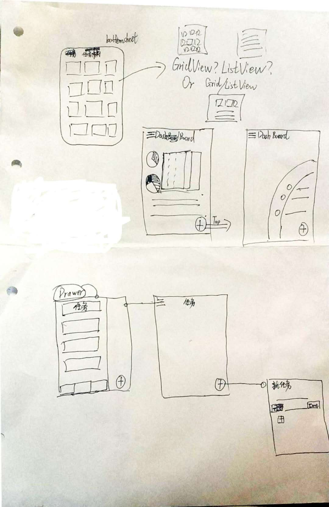

Daily

---

# 概要

## 目标:

> 辅助用户日常事务的管理,构建工作流与培养习惯,同时提供历史数据分析与预测的功能.
> - 提供`功能模块`的扩展的'机制'或某种形式的方式

## 需求看板:
> `功能模块` 此样式代表功能模块名称(暂定);
> `??` 代表暂不确定;

### `功能模块`

- `工作流` (WorkFlow) : 管理任务`??`
  - `任务板` 
    - `任务` 
      - [ ] `CRUD`
      - `子任务`
        - [ ] `CRUD`
        - [ ] 可以有一些属性(如开始时间,持续时间,颜色,背景图像?)可调节;
          - [ ] 自动对接日历事件接口[ical格式](https://en.wikipedia.org/wiki/ICalendar),以Google日历为主;
        - [ ] 可以分类(如标签,颜色等);
        - [ ] 可以检测事件完成(完成时间)或提供一种机制, 如启动一个任务, 有中断(子)任务, 完成(子)任务的选项, 并记录;
      
- `"仪表盘"` (Dashboard)  : 分析工作流数据,展示
  - [ ] 展示所有记录的事项(如任务...)的占比与数据,分别整理日,周,月视图;
  
### `通用模块`

- `设置` (Setting) : 用户偏好设置
  - [ ] 主题选择
  - [ ] 导入/导出数据

# 原型设计

## UI/UX草图

